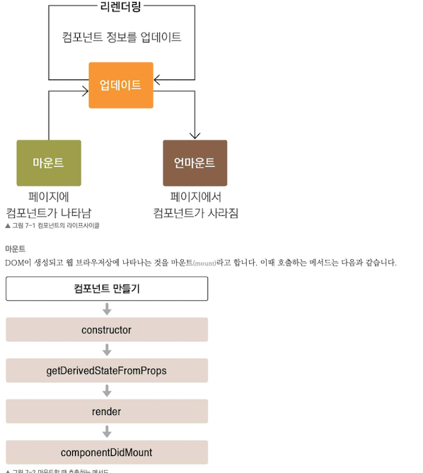

## 라이프 사이클 메서드의 이해
- 라이프 사이클 메서드의 종류는 총 9가지임
- Will 접두사가 붙은 메서드는 어떤 작업을 작동하기 전에 실행되는 메서드
- Did접두사가 붙은 메서드는 어떤 작업을 한 후에 실행되는 메서드임
- 이 메서드들은 우리가 컴포넌트 클래스에서 덮어 써 선언함으로써 사용할 수 있음
- 라이프 사이클은 총 세가지 즉 마운트 언마운트 카테고리로 나눔
- 아래 사진으로 흐름을 파악한다.

- constructor : 컴포넌트를 새로 만들 때마다 호출되는 클래스 생성자 메서드
- getDerivedStateFromProps : props에 있는 값을 state에 넣을 때 사용하는 메서드
- render : 우리가 준비한 UI를 렌더링하는 메서드
- componentDidMount : 컴포넌트가 웹 브라우저상에 나타난 후 호출하는 메서드임

#### 업데이트
- 컴포넌트는 다음과 같은 총 네가지 경우에 업데이트함
  - props가 바뀔 때
  - state가 바뀔 때